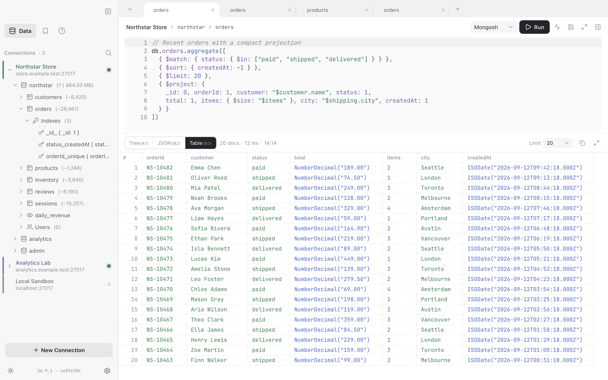
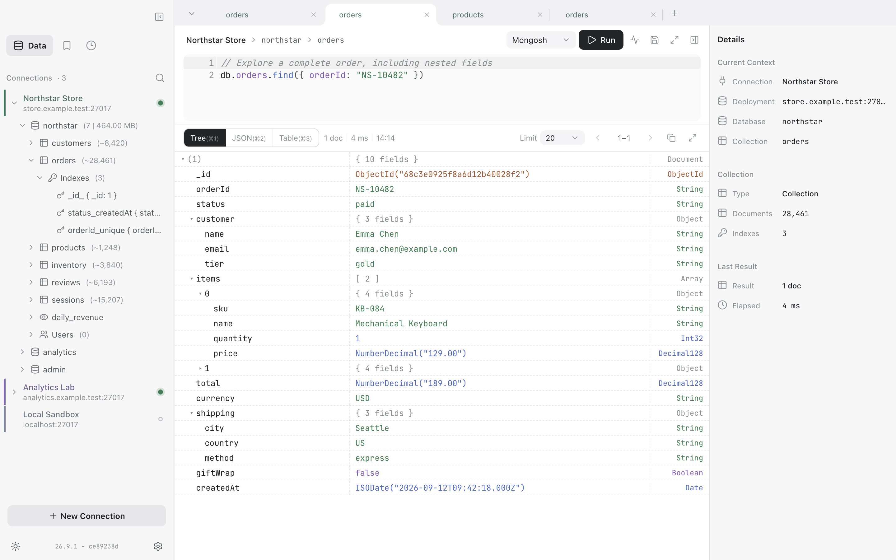
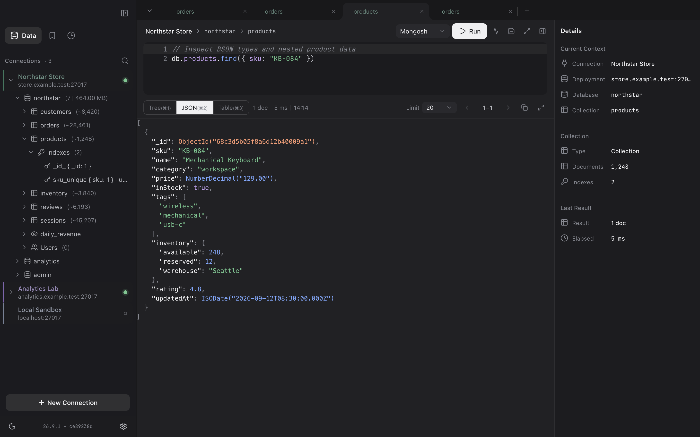
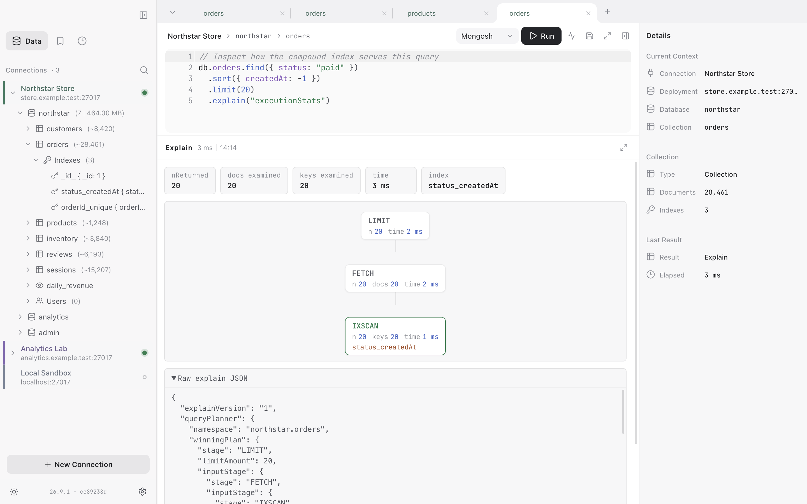

# AMDM (Another Mongo Desktop Manager)

[English](./README.md) | [中文](./README_CN.md)

A lean, performance-first MongoDB desktop GUI, powered by Electron.

> Still under development — don't use it for anything important; no liability for data loss.



<details>
<summary>More screenshots: document tree, dark theme, and visual explain</summary>

**Document tree**



**Dark theme**



**Visual explain**



</details>

## Run

```bash
pnpm install                         # install dependencies
pnpm dev                             # launch the app with hot reload
pnpm typecheck                       # type-check main and renderer
pnpm test:unit                       # unit + contract tests
pnpm build                           # production build into ./out
pnpm dist:dir --mac --arm64          # package an unpacked Apple Silicon app
pnpm install:mac                     # package, replace /Applications/AMDM.app, then launch
pnpm clean                           # remove generated build files
```

## Features

- Browse databases / collections / indexes / users
- Inline document editing, multi-tab views
- A `vm`-sandboxed shell that runs mongosh-style JS (`find` / `aggregate` / `runCommand` …)
- Autocomplete, saved queries, and history
- Native import / export for JSON / JSONL / CSV / TSV / XLSX / BSON
- Tree / JSON / Table result views
- Visual explain

## macOS installation

Requires macOS 12 Monterey or later on both Apple Silicon (arm64) and Intel (x64).

macOS builds update through Sparkle, use ad-hoc signing, and are not notarized. On first launch, select Open Anyway in Privacy & Security or run `xattr -dr com.apple.quarantine /Applications/AMDM.app`.

## License

[GNU GPL v3.0](./LICENSE)

> AMDM is an unofficial MongoDB client and is not affiliated with MongoDB, Inc. in any way.
